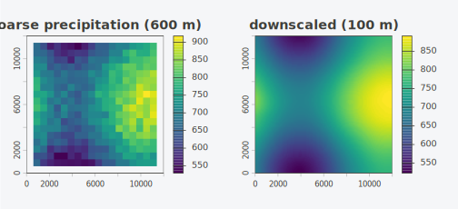
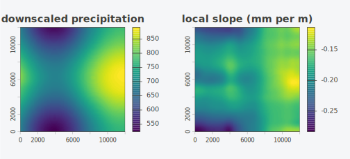
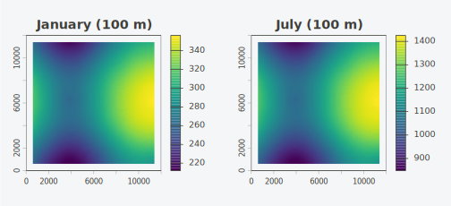
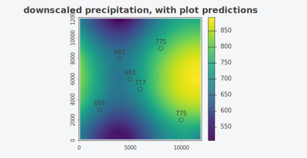

# Getting started with topocast

A coarse climate grid tells you the precipitation over a 600 m cell. A
digital elevation model tells you the terrain at 100 m. `topocast` joins
the two: it learns how the coarse variable tracks the terrain, locally,
and rewrites the coarse grid at the resolution of the elevation model.
The relationship is fit once per neighbourhood with a moving-window
regression, and the cost does not grow with the window size.

This vignette downscales a synthetic precipitation field, adds a second
terrain predictor, carries a short time series, and drops down to the
matrix engine that does the work.

``` r

library(topocast)
library(terra)
#> terra 1.9.27
```

## A landscape to downscale

We need a fine-resolution terrain and a coarse climate observation. We
build the terrain at 100 m as a smooth surface, then aggregate elevation
to a 600 m grid to stand in for a coarse product. Precipitation is
observed only on that coarse grid.

``` r

set.seed(1)
fine <- rast(nrows = 120, ncols = 120,
             xmin = 0, xmax = 12000, ymin = 0, ymax = 12000,
             crs = "EPSG:32632")
xy <- crds(fine)
elev_fine <- setValues(fine, 1200 + 600 * sin(xy[, 1] / 2500) +
                               400 * cos(xy[, 2] / 2000))
names(elev_fine) <- "elev"
slope_fine <- terrain(elev_fine, v = "slope", unit = "degrees")
names(slope_fine) <- "slope"
```

The coarse grid is the same landscape at 600 m, six fine cells to a
side.

``` r

elev_coarse  <- aggregate(elev_fine,  fact = 6, fun = "mean")
slope_coarse <- aggregate(slope_fine, fact = 6, fun = "mean")
```

Precipitation falls with elevation and rises on steeper ground, with
noise that the terrain does not explain. We observe it on the coarse
grid only.

``` r

prec_coarse <- 900 - 0.18 * elev_coarse + 4 * slope_coarse +
  setValues(elev_coarse, rnorm(ncell(elev_coarse), 0, 20))
names(prec_coarse) <- "prec"
```

The response and its predictors go into one `SpatRaster`, so they share
a grid by construction. The fine predictors go into a second raster on
the target grid.

``` r

coarse  <- c(prec_coarse, elev_coarse, slope_coarse)
terrain <- c(elev_fine, slope_fine)
coarse
#> class       : SpatRaster
#> size        : 20, 20, 3  (nrow, ncol, nlyr)
#> resolution  : 600, 600  (x, y)
#> extent      : 0, 12000, 0, 12000  (xmin, xmax, ymin, ymax)
#> coord. ref. : WGS 84 / UTM zone 32N (EPSG:32632)
#> source(s)   : memory
#> names       :       prec,        elev,     slope
#> min values  : 529.303613,  203.183895,  1.281186
#> max values  : 918.058795, 2192.634046, 17.237889
```

## One predictor

A single call downscales the coarse precipitation onto the fine
elevation. The formula names the response and the predictor; both names
must be layers of `coarse`, and the predictor must also be a layer of
`onto`.

``` r

fine_prec <- topocast(prec ~ elev, data = coarse, onto = terrain, radius = 4)
fine_prec
#> class       : SpatRaster
#> size        : 120, 120, 1  (nrow, ncol, nlyr)
#> resolution  : 100, 100  (x, y)
#> extent      : 0, 12000, 0, 12000  (xmin, xmax, ymin, ymax)
#> coord. ref. : WGS 84 / UTM zone 32N (EPSG:32632)
#> source(s)   : memory
#> name        :       prec
#> min value   : 523.348712
#> max value   : 891.435878
```

The result is a 120 by 120 grid where the coarse input was 20 by 20.
Plotting the two side by side shows where the detail comes from: the
coarse field sets the broad level, the elevation carries the texture.

``` r

par(mfrow = c(1, 2), mar = c(2, 2, 2, 4))
plot(prec_coarse, main = "coarse precipitation (600 m)")
plot(fine_prec,   main = "downscaled (100 m)")
```



The `radius` is measured in coarse cells. A radius of 4 means each
regression sees a 9 by 9 window of coarse cells, here a 5.4 km
neighbourhood. Inside that window `topocast` fits one intercept and one
slope, then resamples those coefficients to the fine grid and evaluates
`intercept + slope * elev` at every fine cell.

## Several predictors

Naming more layers adds predictors. Each one is matched by name between
`data` and `onto`, so layer order does not matter and a missing layer is
an error rather than a silent mismatch.

``` r

fine_prec2 <- topocast(prec ~ elev + slope, data = coarse, onto = terrain,
                       radius = 4)
```

A misnamed predictor stops the call and lists what is available, which
saves a debugging session over a quietly wrong raster.

``` r

topocast(prec ~ elev + aspect, data = coarse, onto = terrain, radius = 4)
#> Error in `resolve_predictors()`:
#> ! predictor `aspect` named in `formula` is in neither `data` nor `onto`.
#>   data layers: prec, elev, slope
#>   onto layers: elev, slope
```

## The one-DEM shortcut

The common case has one coarse climate layer and one fine elevation
model, and no coarse predictor in hand. A predictor named in the formula
but absent from `data` is derived from `onto` by aggregating it to the
response grid, so the coarse elevation does not have to be built by
hand.

``` r

shortcut <- topocast(prec ~ elev + slope, data = prec_coarse, onto = terrain,
                     radius = 4)
```

Here `data` is the coarse precipitation alone; `elev` and `slope` are
aggregated from `terrain` to the coarse grid with `aggregate`, the cell
average by default, before the fit. The downscaled field reproduces the
explicit-predictor result to resampling tolerance.

``` r

round(max(abs(values(shortcut) - values(fine_prec2)), na.rm = TRUE), 4)
#> [1] 1e-04
```

## Mapping the local relationship

The reason to downscale by regression rather than by interpolation is
the local relationship between the response and the terrain.
`coefficients = TRUE` returns that relationship as grids: the fitted
layer, the intercept, and one slope per predictor, all on the fine grid.

``` r

grids <- topocast(prec ~ elev, data = coarse, onto = terrain, radius = 4,
                  coefficients = TRUE)
names(grids)
#> [1] "prec"        "(Intercept)" "elev"

par(mfrow = c(1, 2), mar = c(2, 2, 2, 4))
plot(grids[["prec"]], main = "downscaled precipitation")
plot(grids[["elev"]], main = "local slope (mm per m)")
```



The slope layer is the local precipitation lapse rate. Where it is
steep, elevation explains most of the variation in precipitation; where
it is near zero, the terrain carries little signal and the downscaled
field stays close to the coarse input.

## A time series

Climate downscaling usually means many time steps sharing one terrain
relationship. Passing a stack of coarse periods as `anomaly` fits the
baseline once and carries each period onto it. Use `type = "ratio"` for
non-negative variables such as precipitation and `type = "additive"` for
variables such as temperature.

``` r

jan <- prec_coarse * 0.4
jul <- prec_coarse * 1.6
months <- c(jan, jul)
names(months) <- c("jan", "jul")

series <- topocast(prec ~ elev + slope, data = coarse, onto = terrain,
                   radius = 4, anomaly = months, type = "ratio")
nlyr(series)
#> [1] 2
```

The baseline climatology is downscaled with the regression; each period
is then the fine baseline scaled by that period’s coarse anomaly. The
ratio path guards a zero baseline by returning `NA` rather than dividing
by zero.

``` r

par(mfrow = c(1, 2), mar = c(2, 2, 2, 4))
plot(series[["jan"]], main = "January (100 m)")
plot(series[["jul"]], main = "July (100 m)")
```



## Points and other spatial classes

A common target is a set of locations instead of a full grid: vegetation
plots, weather stations, survey sites. Passing those points as `onto`
evaluates the fitted relationship at each one and returns the points
with a prediction column. The points carry the fine predictors as
attributes; here they are read from the elevation model.

``` r

library(sf)
#> Linking to GEOS 3.14.1, GDAL 3.12.1, PROJ 9.7.1; sf_use_s2() is TRUE

plots <- st_as_sf(
  data.frame(x = c(2000, 4000, 6000, 8000, 10000, 5000),
             y = c(3000, 8000, 5000, 9000,  2000, 6000)),
  coords = c("x", "y"), crs = "EPSG:32632")

at_terrain <- terra::extract(terrain, vect(plots))
plots$elev  <- at_terrain$elev
plots$slope <- at_terrain$slope

at_plots <- topocast(prec ~ elev + slope, data = coarse, onto = plots, radius = 4)
at_plots
#> Simple feature collection with 6 features and 3 fields
#> Geometry type: POINT
#> Dimension:     XY
#> Bounding box:  xmin: 2000 ymin: 2000 xmax: 10000 ymax: 9000
#> Projected CRS: WGS 84 / UTM zone 32N
#>             geometry      elev     slope     prec
#> 1  POINT (2000 3000) 1676.9474 14.449248 657.9065
#> 2  POINT (4000 8000) 1530.3309  8.444084 661.3340
#> 3  POINT (6000 5000) 1281.9755 12.323577 717.4466
#> 4  POINT (8000 9000) 1058.9375 17.128046 775.1305
#> 5 POINT (10000 2000)  962.6333 12.706625 775.3137
#> 6  POINT (5000 6000) 1346.0137  6.239848 683.3556
```

The fit at a point is the coarse coefficients interpolated to the
location and applied to the point’s predictors, the same regression the
grid path evaluates per cell. Overlaying the points on the downscaled
field shows the two agree.

``` r

pv <- vect(plots)
plot(fine_prec2, main = "downscaled precipitation, with plot predictions")
plot(pv, add = TRUE, pch = 21, cex = 1.3)
text(crds(pv), labels = round(at_plots$prec), pos = 3, cex = 0.8)
```



The same call returns a plain data frame of coordinates and predictions
with `output = "data.frame"`, for joining back to a plot table.

``` r

topocast(prec ~ elev + slope, data = coarse, onto = plots, radius = 4,
         output = "data.frame")
#>       x    y     prec
#> 1  2000 3000 657.9065
#> 2  4000 8000 661.3340
#> 3  6000 5000 717.4466
#> 4  8000 9000 775.1305
#> 5 10000 2000 775.3137
#> 6  5000 6000 683.3556
```

Gridded inputs are not tied to `SpatRaster` either. A `Raster*` object
from the raster package or a `stars` object is accepted for `data` and
`onto`, and the result is returned in the class it was given; `output`
requests another. The class sets only the container for the result, and
the numbers are the same.

## The matrix engine

[`topocast()`](https://gillescolling.com/topocast/reference/topocast.md)
is a terra workflow over a matrix engine,
[`window_regression()`](https://gillescolling.com/topocast/reference/window_regression.md),
which fits the moving-window regression on plain numeric matrices and
returns the intercept and slope grids. It is useful for testing and for
callers who already hold their data as matrices.

``` r

y <- as.matrix(prec_coarse, wide = TRUE)
x <- list(as.matrix(elev_coarse, wide = TRUE),
          as.matrix(slope_coarse, wide = TRUE))
fit <- window_regression(y, x, radius = 4)
str(fit, max.level = 2)
#> List of 2
#>  $ intercept: num [1:20, 1:20] 823 794 881 854 889 ...
#>  $ slope    :List of 2
#>   ..$ : num [1:20, 1:20] -0.164 -0.154 -0.184 -0.179 -0.188 ...
#>   ..$ : num [1:20, 1:20] 7.57 8.33 5.85 7.11 5.71 ...
```

The elevation slope recovers the coefficient we simulated. Over a window
that spans most of the grid the local fit converges on the global value.

``` r

big <- window_regression(y, x, radius = 19)
round(median(big$slope[[1]], na.rm = TRUE), 3)   # simulated -0.18
#> [1] -0.178
```

## Practical guidance

A few choices shape the result.

**Radius.** The window sets how local the relationship is. A small
radius lets the slope vary across the map but needs enough valid cells
to fit; with two predictors a window must hold at least three cells, and
more for a stable fit. A large radius approaches a single global
regression. Start near the scale over which you expect the
climate-terrain relationship to be stationary, often a few to a couple
dozen coarse cells.

**Resampling method.** The coefficient grids are resampled to the fine
grid with `method`, defaulting to `"cubicspline"`. Cubic spline gives
smooth coefficient surfaces; `"bilinear"` is a safer choice when the
coefficients are noisy and you want to avoid overshoot.

**Degenerate windows.** A cell returns `NA` when its window has fewer
valid cells than the model needs, when a predictor has no spread
(`min_variance`), or when the design is singular. `min_cells` raises the
valid-cell requirement above the bare minimum if you want a margin.

**Collinear predictors.** Over a small extent, precipitation and
elevation can be nearly collinear, which makes the local slope unstable
even though the fit succeeds. This is a property of the data, not a
defect; widen the window, drop a predictor, or inspect the slope grid
(via `coefficients = TRUE`) for noise.

**Deriving the coarse predictor.** When a predictor is named in the
formula but is not a layer of `data`, it is aggregated from `onto` to
the response grid with `aggregate`, a cell average by default. Set it to
another \[terra::resample()\] method if a different aggregation suits
the predictor.

**What the output conserves.** The downscaled field is a regression
surface evaluated on the fine predictors. Averaging it back to the
coarse grid does not reproduce the coarse input exactly, because the
coarse residual is not carried. The `anomaly` path is what restores
fidelity to the coarse values over time: each period’s coarse anomaly is
carried verbatim onto the fine baseline.

**Coordinate systems.** `data` and `onto` should share a coordinate
reference system. Two systems with the same EPSG code are treated as
equal even when their WKT strings differ, which is common with
cross-source lon/lat data such as a DEM and a climate product from
different providers. A genuine mismatch is an error that names both
systems.

See
[`vignette("how-it-works", package = "topocast")`](https://gillescolling.com/topocast/articles/how-it-works.md)
for the summed-area-table method behind the constant per-cell cost.
