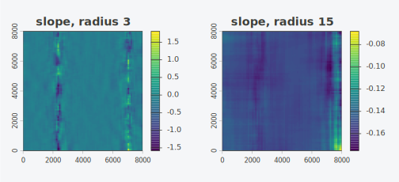

# How moving-window downscaling works

Downscaling a climate grid with terrain rests on a long-standing idea: a
climate variable often tracks elevation through a roughly linear
relationship, so a high-resolution elevation model can carry the
variable to a finer grid through a regression. This is the
regression-on-elevation step behind high-resolution climate surfaces
such as CHELSA (Karger et al. 2017). `topocast` generalises the
predictor from elevation alone to any set of aligned terrain covariates,
fits the relationship locally rather than globally, and keeps the
per-cell cost independent of the neighbourhood size.

This vignette describes the method: the local regression, the
summed-area tables that make it fast, the numerical choices, and what
the output does and does not preserve.

## A regression in every neighbourhood

A global regression of the coarse response $`y`$ on $`k`$ predictors
$`x_1, \dots,
x_k`$ assumes one relationship over the whole map. Terrain-climate
relationships are not that stable: a lapse rate on a windward slope
differs from one in a rain shadow. `topocast` instead fits a separate
ordinary least squares regression in a square window around every coarse
cell. For the cell at row $`r`$, column $`c`$, the window of radius
$`\rho`$ holds the cells within $`\rho`$ rows and columns, and the fit
solves

``` math
\min_{\beta} \sum_{(i,j) \in W_{rc}} \Big( y_{ij} - \beta_0 - \sum_{m=1}^{k} \beta_m \, x_{m,ij} \Big)^2 .
```

The result is a grid of intercepts $`\hat\beta_0(r,c)`$ and a grid of
slopes $`\hat\beta_m(r,c)`$ for each predictor, all at the coarse
resolution. These coefficient grids are the locally varying relationship
between the response and the terrain, and
`topocast(..., coefficients = TRUE)` returns them on the fine grid
alongside the fitted layer.

The downscaling step resamples each coefficient grid to the fine
resolution and evaluates the regression on the fine predictors:

``` math
\hat y(f) = \hat\beta_0(f) + \sum_{m=1}^{k} \hat\beta_m(f)\, x_m(f),
```

where $`f`$ indexes fine cells and the coefficients are the resampled
coarse grids. The fine-scale structure of the output comes entirely from
the fine predictors; the coefficients carry the relationship.

## Constant cost with summed-area tables

A naive moving window re-sums every cell in the neighbourhood for every
centre, so its cost grows with the window area. For a radius of 20 that
is over 1,600 cells touched per output cell. `topocast` avoids this with
summed-area tables, also called integral images.

The normal equations for the window fit are $`A \beta = b`$, where $`A`$
holds the within-window sums $`\sum 1`$, $`\sum x_m`$, and
$`\sum x_m x_{m'}`$, and $`b`$ holds $`\sum y`$ and $`\sum x_m y`$. Each
of these is a sum of a fixed quantity over the window. For any grid
$`g`$, the summed-area table $`S`$ stores the sum over the rectangle
from the top-left corner to each cell:

``` math
S(r,c) = \sum_{i \le r,\, j \le c} g_{ij}.
```

With $`S`$ built once in a single pass, the sum over any rectangular
window is four lookups:

``` math
\sum_{(i,j)\in W} g_{ij} = S(r_1,c_1) - S(r_0-1,c_1) - S(r_1,c_0-1) + S(r_0-1,c_0-1).
```

`topocast` builds one table for the cell count, one for $`\sum y`$, one
per predictor for $`\sum x_m`$ and $`\sum x_m y`$, and one per predictor
pair for $`\sum
x_m x_{m'}`$. Every window then assembles $`A`$ and $`b`$ from four
lookups each, solves a $`(k{+}1) \times (k{+}1)`$ system, and stores the
coefficients. The total cost is proportional to the number of cells and
the small per-cell solve, with no dependence on the radius.

The radius below changes the smoothness of the slope grid but not the
runtime.

``` r

set.seed(1)
g <- rast(nrows = 80, ncols = 80, xmin = 0, xmax = 8000, ymin = 0, ymax = 8000,
          crs = "EPSG:32632")
elev <- setValues(g, 1000 + 500 * sin(crds(g)[, 1] / 1500))
prec <- 800 - 0.15 * elev + setValues(g, rnorm(ncell(g), 0, 15))

y <- as.matrix(prec, wide = TRUE)
x <- as.matrix(elev, wide = TRUE)
small <- window_regression(y, x, radius = 3)
large <- window_regression(y, x, radius = 15)

par(mfrow = c(1, 2), mar = c(2, 2, 2, 4))
plot(setValues(elev, as.vector(t(small$slope[[1]]))), main = "slope, radius 3")
plot(setValues(elev, as.vector(t(large$slope[[1]]))), main = "slope, radius 15")
```



## Numerical and masking choices

**Global centring.** Before accumulation the response and each predictor
are centred on their global mean over the valid cells. Centring keeps
the entries of $`A`$ small even when elevation runs into the thousands,
which conditions the solve. The intercept is mapped back to the raw
response and predictor scale on output, so the returned coefficients are
on the original units.

**Complete-case masking.** A cell contributes to a window only where the
response and every predictor are finite. A separate count table tracks
how many valid cells fall in each window, and invalid cells are set to
zero in the centred copies so they drop out of the sums without
distorting them.

**Degenerate windows.** A cell is returned as `NA` in three cases: the
window holds fewer valid cells than the model needs (`k + 1`, raised by
`min_cells`); a predictor has within-window variance below
`min_variance`, so its slope is not identified; or the assembled system
is singular. These guards keep a flat or data-starved neighbourhood from
producing a meaningless coefficient.

## Carrying a time series

A climatology is one field. A time series shares the terrain
relationship across many periods, so refitting the regression each
period would be wasteful and would let the spatial pattern drift between
steps. `topocast` instead downscales the baseline once and carries each
period’s coarse anomaly onto the fine baseline.

For a period with coarse value $`v`$, coarse baseline $`b`$, and fine
baseline $`\hat y_b`$, the ratio path returns

``` math
\hat y = \hat y_b \cdot \frac{v}{b},
```

and the additive path returns $`\hat y = \hat y_b + (v - b)`$. The ratio
suits non-negative variables such as precipitation; the additive form
suits variables such as temperature where a difference is the natural
anomaly. Both carry the coarse anomaly verbatim, so the downscaled
series tracks the coarse values over time even though the baseline
itself is a regression surface. A zero or missing baseline in the ratio
path returns `NA` rather than dividing by zero.

## What the output preserves

The downscaled field is the regression evaluated on the fine predictors.
Two consequences are worth stating plainly.

The output is not mass conserving. Averaging the fine field back to the
coarse grid does not reproduce the coarse input, because the coarse
residual, the part of $`y`$ the regression did not explain, is
discarded. For a smoothed climate product this is usually acceptable,
and the `anomaly` path restores fidelity to the coarse values for the
time-varying part.

The slopes are applied to the full fine-predictor range. Where the fine
elevation reaches values the coarse window never saw, the regression
extrapolates linearly. The fine output is only as trustworthy as a
linear relationship over that extended range, which is a reason to keep
predictors that stay roughly linear with the response and to inspect the
result where the terrain is extreme.

## Reference

Karger, D. N., Conrad, O., Bohner, J., Kawohl, T., Kreft, H.,
Soria-Auza, R. W., Zimmermann, N. E., Linder, H. P., and Kessler, M.
(2017). Climatologies at high resolution for the earth’s land surface
areas. *Scientific Data* 4, 170122. <doi:10.1038/sdata.2017.122>
